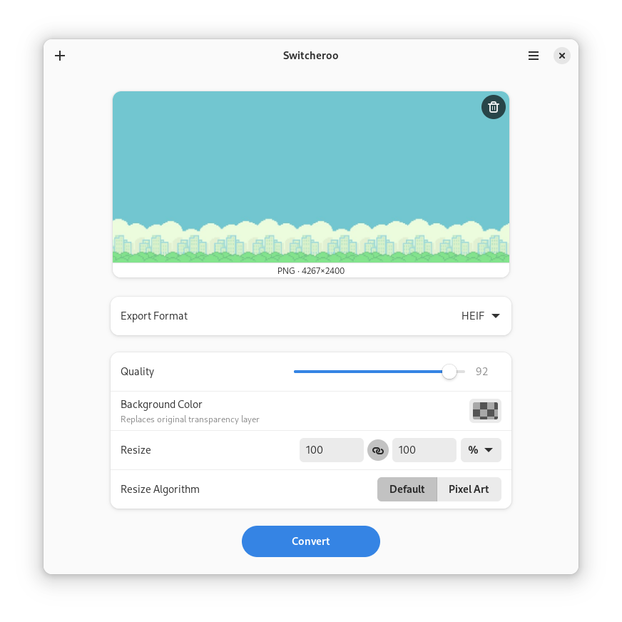

<div align="center">
<h1>Switcheroo</h1>

Convert and manipulate images


[](https://flathub.org/apps/details/io.gitlab.adhami3310.Converter)
[](https://gitlab.com/adhami3310/Switcheroo/-/tags)
[](https://gitlab.com/adhami3310/Switcheroo/-/raw/main/COPYING)


</div>

## Installation
<a href='https://flathub.org/apps/details/io.gitlab.adhami3310.Converter'></a>

It is advised that you manually give it "All user files" (filesystem=home) through Flatseal to overcome [this Flatpak issue](https://github.com/flatpak/xdg-desktop-portal/issues/477), so it can suggest you to save the output file in the same input directory. It will then also allow you to save files directly instead of compressing them when doing batch processing.

## About

Switcheroo is designed to give you a simple, quick, and easy-to-use tool to convert and manipulate your images in whatever way you like. It is built on top of the most advanced image editing libraries, ImageMagick. See [Press](PRESS.md) for content mentioning Switcheroo from various writers, content creators, etc.



Switcheroo supports converting the following datatypes:
 - image/jpeg (RW) (through MozJPEG)
 - image/png (RW)
 - image/webp (RW)
 - image/svg+xml (R) (with scaling)
 - image/heif (RW) and image/heic (RW)
 - image/bmp (RW)
 - image/avif (RW)
 - image/jxl (RW) (no animation support)
 - application/pdf (RW) (with scaling via ghostscript)
 - image/tiff (RW)
 - image/gif (RW)
 - image/x-icon (R)

It also supports the following options:
 - Changing quality value of lossy compression.
 - Changing the color value of the alpha layer.
 - Changing the DPI of SVG images.
 - Scaleing and resizing the image to given resolution or ratio.
 - Dividing animated GIF and WEBP into its individual frames.
 - Batch processing of images.

You can also drag and drop as well as paste the copied image into the app!

ImageMagick supports many other datatypes. I will add more and possibly even add more options. If you want me to make something of a higher priority please start an issue.

## Contributing
Issues and merge requests are more than welcome. However, please take the following into consideration:

- This project follows the [GNOME Code of Conduct](https://wiki.gnome.org/Foundation/CodeOfConduct)
- Only Flatpak is supported

## Development

### GNOME Builder
The recommended method is to use GNOME Builder:

1. Install [GNOME Builder](https://apps.gnome.org/app/org.gnome.Builder/) from Flathub
1. Open Builder and select "Clone Repository..."
1. Clone `https://gitlab.com/adhami3310/Switcheroo.git` (or your fork)
1. Press "Run Project" (▶) at the top, or `Ctrl`+`Shift`+`[Spacebar]`.

### Flatpak
You can install Switcheroo from the latest commit:

1. Install [`org.flatpak.Builder`](https://github.com/flathub/org.flatpak.Builder) from Flathub
1. Clone `https://gitlab.com/adhami3310/Switcheroo.git` (or your fork)
1. Run `flatpak run org.flatpak.Builder --install --user --force-clean build-dir io.gitlab.adhami3310.Switcheroo.json` in the terminal from the root of the repository.

### Meson
You can build and install on your host system by directly using the Meson buildsystem:

1. Install `blueprint-compiler`
1. Run the following commands (with `/usr` prefix):
```
meson --prefix=/usr build
ninja -C build
sudo ninja -C build install
```

## Credits

Actively developed by Khaleel Al-Adhami.

This is a fork of [`Upscaler`](https://gitlab.com/TheEvilSkeleton/Upscaler) by Hari Rana (TheEvilSkeleton) to convert images instead of upscaling them. Check out their project!

This app uses a variety of libraries but the main one is [ImageMagick](https://github.com/ImageMagick/ImageMagick), which without their generous contribution to the open source community this would be nearly impossible to make.
